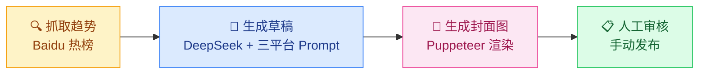
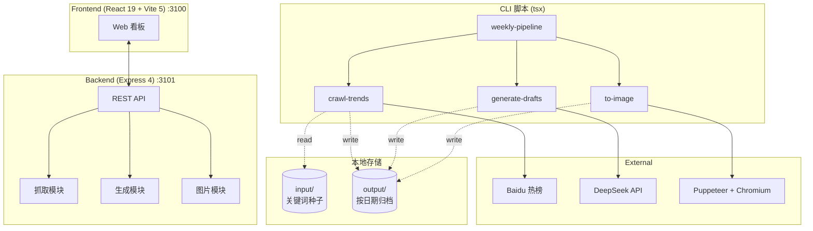
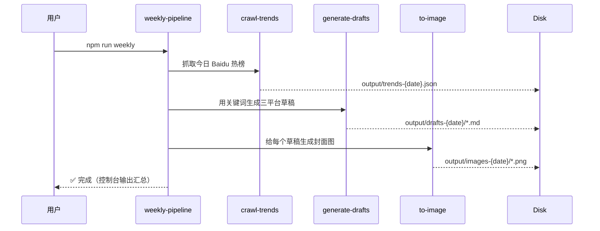

# Auto Content · 流量引擎

> 自用 AI 文案自动流 — 一键产出小红书 / 知乎 / 闲鱼三平台草稿与封面图，仅生成**草稿**，人工审核后手动发布。

<p align="center">
  
  
  
  
  
  
</p>

---

## 🪞 流水线全景



**核心理念**：AI 负责"找话题 + 写初稿 + 配图"，人负责"最终审核 + 平台调性微调 + 发布"。

---

## ✨ 特性矩阵

| 模块 | 功能 | 脚本 / API | 端口 |
|------|------|------------|------|
| 🔍 **趋势抓取** | Baidu 热榜实时拉取，去重 + 排序 | `npm run crawl` / `POST /api/crawl` | — |
| 📝 **草稿生成** | DeepSeek + 三套平台 Prompt（小红书爆款 / 知乎深度 / 闲鱼口语） | `npm run generate` / `POST /api/generate` | — |
| 🎨 **封面图生成** | Puppeteer 渲染 HTML 模板为 PNG | `npm run images` / `GET /api/images` | — |
| 🌐 **Web 看板** | React SPA，展示趋势 / 草稿 / 封面图 | `npm run dev:web` | `:3100` |
| 🛰 **API 服务** | Express REST | `npm run dev:server` | `:3101` |
| 📅 **周报自动流** | 一键跑完"抓→写→图"全链路 | `npm run weekly` | — |

---

## 🏗 系统架构



---

## 🚀 快速开始

### 前置条件

- Node.js ≥ 20
- npm ≥ 10
- DeepSeek API Key（[platform.deepseek.com](https://platform.deepseek.com)）
- Puppeteer 自动下载 Chromium（首次 `npm install` 自动）

### 安装 & 启动

```bash
cd auto-content
npm install
cp .env.example .env
# 编辑 .env 填入 DEEPSEEK_API_KEY
```

**开两个终端**：

```bash
# 终端 1：API 服务
npm run dev:server    # → http://localhost:3101

# 终端 2：Web 看板
npm run dev:web       # → http://localhost:3100
```

**一条命令跑完整流水线**（适合每日定时）：

```bash
npm run weekly
```

---

## 📁 目录结构

```
auto-content/
├── src/                      # React 本地 Web UI
│   ├── App.tsx               # 主应用
│   ├── main.tsx              # 入口
│   └── index.css             # 全局样式
│
├── server/                   # Express API
│   └── index.ts              # REST 端点
│
├── scripts/                  # 核心业务脚本
│   ├── crawl-trends.ts       #   抓 Baidu 热榜
│   ├── generate-drafts.ts    #   DeepSeek 生成三平台草稿
│   ├── to-image.ts           #   Puppeteer 渲染封面图
│   ├── weekly-pipeline.ts    #   一键全链路
│   └── lib/paths.ts          #   共享路径工具
│
├── templates/                # 三平台 Prompt 模板
│   ├── xiaohongshu-prompt.md #   小红书爆款风格（emoji + 短句）
│   ├── zhihu-prompt.md       #   知乎深度风格（结构化 + 论据）
│   └── xianyu-prompt.md      #   闲鱼口语风格（场景化 + 价格）
│
├── input/                    # 关键词种子（git 跟踪）
│   └── keywords-seed.json    #   启动关键词池
│
├── output/                   # 运行时生成（git ignore）
│   ├── trends-2026-06-30.json
│   ├── drafts-2026-06-30/    # 按平台分目录
│   └── images-2026-06-30/    # 封面图 PNG
│
├── .env.example
├── package.json
├── tsconfig.json
├── vite.config.ts
└── README.md
```

---

## 🛠 技术栈

| 层 | 选型 | 理由 |
|----|------|------|
| 前端框架 | **React 19** + Vite 5 | SPA 启动快 + HMR 流畅 |
| 样式 | 原生 CSS + CSS Variables | 不引入 Tailwind，保持工具轻量 |
| 后端 | **Express 4** + TypeScript | 简单稳定的 REST 框架 |
| LLM | **DeepSeek**（OpenAI 兼容 SDK） | 中文文案质量优 + 成本低 |
| 抓取 | **axios** + **cheerio** | 轻量 HTTP + HTML 解析 |
| 渲染 | **Puppeteer 23** | 用 Chromium 渲染 HTML 模板为 PNG |
| 类型 | **TypeScript 5** | 全栈类型安全 |
| 进程管理 | `concurrently` | `npm run dev` 一键起前后端 |

---

## 🔌 API 端点

| 方法 | 路径 | 说明 | 返回 |
|------|------|------|------|
| `GET` | `/api/health` | 健康检查 | `{ ok: true }` |
| `GET` | `/api/trends` | 获取今日趋势 | `TrendKeyword[]` |
| `POST` | `/api/crawl` | 触发抓取 | `{ count, trends }` |
| `GET` | `/api/drafts` | 获取今日草稿 | `[{ name, content }]` |
| `POST` | `/api/generate` | 触发生成 | `{ generated: number }` |
| `GET` | `/api/images` | 获取今日封面图 | `string[]`（文件名） |
| `GET` | `/api/images/file/:name` | 单张图片文件 | PNG 二进制 |

---

## 📜 平台风格对照

| 平台 | 调性 | 字数 | 配图 |
|------|------|------|------|
| **小红书** | 爆款 + emoji 密集 + 短句 | 300-500 | 强视觉封面 |
| **知乎** | 深度 + 结构化 + 论据链 | 800-1500 | 简洁配图 |
| **闲鱼** | 口语化 + 场景化 + 价格引导 | 100-200 | 实拍风 |

每套 Prompt 在 `templates/` 下独立维护，调风格改对应 `.md` 即可。

---

## ⚙️ 配置

`.env` 文件：

```env
# DeepSeek API
DEEPSEEK_API_KEY=sk-xxxxxxxx
DEEPSEEK_BASE_URL=https://api.deepseek.com
DEEPSEEK_MODEL=deepseek-chat

# 服务端口
WEB_PORT=3100
API_PORT=3101
```

---

## 🗓 周报自动流

`npm run weekly` 执行顺序：



---

## 🛡 免责声明

- **仅生成草稿**：本工具不直接发布到任何平台，发布动作由人工完成
- **平台合规**：发布前请遵守各平台社区规范（小红书/知乎/闲鱼）
- **AI 标注**：按法规要求，AI 生成内容发布时建议标注

---

## 📄 License

MIT © TimeCraker
